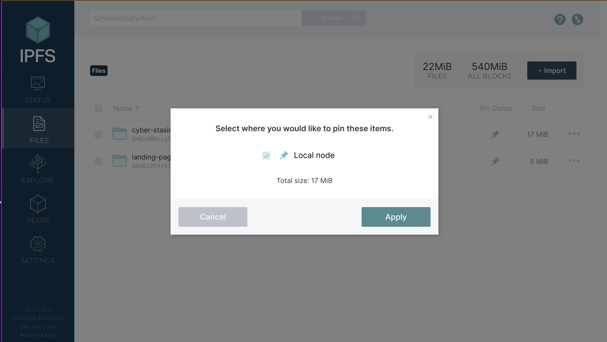

# Cyber Stasis


## The problem with money

https://github.com/stateless-minds/cyber-stasis/wiki/What-is-the-problem-with-money%3F

## Moneyless market economy

https://github.com/stateless-minds/cyber-stasis/wiki/What-is-moneyless-economy-and-what-it-isn't

Cyber Stasis is an economic simulator in the form of a free fictional game. The interface is a futuristic dashboard which coordinates global real-time demand and supply. The model is based on gift economy and tests the hypothesis of having a market system without any type of exchange be it barters or money.
The market system provides a feedback loop between production and consumption and is oriented towards efficiency of distribution. Everything that we measure with money can be measured by a ratio between supply and demand. There is no private property and a concept of wealth. Everyone is connected anonymously to prevent forming of alliances and cartels. The goal of the system is to make sure that all needs are met to the best extent possible. There is a personal reputation index which measures your contributions to society but it does not give any privileges. The goal of the game is to become the most useful member of society.

## How does it look in real life though?

Imagine replacing millions of marketplaces and platforms with a single p2p app where all supply and demand happens in real-time. No one owns the app, all users are anonymous and all data is public. All products are made by function and for reuse rather than for ownership and status showoff. All users are served from nearby public depots and the consumption cycle is - get, use, return, recycle. Because we have no brands and competition naturally there is no use for money. Every day we open up the everything app to request what we need for the day and to provide what we can. Thanks to rise in productivity and automation it is a true resource-based gift economy that both reduces work time and fulfills all demands better than money based systems where money is the limited resource which keeps us in the loop of artificial scarcity.

## Screenshots

<a display="inline" href="./assets/home.png?raw=true">

</a>

<a display="inline" href="./assets/ranks.png?raw=true">

</a>

<a display="inline" href="./assets/story.png?raw=true">

</a>

<a display="inline" href="./assets/mission.png?raw=true">

</a>

## Community

https://www.reddit.com/r/CyberStasis/

## How to Play

The game runs on the public IPFS network. In order to play it follow the steps below:

1. Install the official IPFS Desktop http://docs.ipfs.io/install/ipfs-desktop/
2. Install IPFS Companion http://docs.ipfs.io/install/ipfs-companion/
3. Install golang 1.17 or later version - https://go.dev/doc/install
4.  Clone https://github.com/stateless-minds/kubo to your local machine
```
git clone https://github.com/stateless-minds/kubo.git
```
5.  Follow the instructions here to open your config file: https://github.com/ipfs/kubo/blob/master/docs/config.md. Usually it's `~/.ipfs/config` on Linux. Add the following snippet to the `HTTPHeaders`:
```{
  "API": {
    "HTTPHeaders": {
      "Access-Control-Allow-Origin": ["webui://-", "http://localhost:3000", "http://bafybeidl3ode53s2imudu5y2khpalqv7hwbmmy4dezsf7a4depkvm2c2eu.ipfs.localhost:8080", "http://127.0.0.1:5001", "https://webui.ipfs.io"],
      "Access-Control-Allow-Credentials": ["true"],
      "Access-Control-Allow-Methods": ["PUT", "POST"]
    }
  },
 ```
6. Build it and start the daemon:
``` 
cd kubo
make build
./cmd/ipfs/ipfs daemon --enable-pubsub-experiment
```
7.  Navigate to <a href="https://ipfs.io/ipfs/QmVbgUuNz28nmMn63spZRydzDQneLewwUCGLtZGBnSEx8U">https://ipfs.io/ipfs/QmVbgUuNz28nmMn63spZRydzDQneLewwUCGLtZGBnSEx8U</a> and let's simulate the future together!
8.  If you like the game consider pinning it to your local node so that you become a permanent host of it while you have IPFS daemon running



Please note the game has been developed on a WQHD resolution(2560x1440) and is currently not responsive or optimized for mobile devices. For best gaming experience if you play in FHD(1920x1080) please set your browser zoom settings to 150%.

## Guidelines

* **Economic simulator** - Cyber Stasis is an economic simulator in the form of a fictional game based on global real-time demand and supply.
* **Real-time demand/supply graph** - The graph reflects all demand and supply requests and is updated in real-time.
* **Supply can be sent only in response to an existing demand** - Send only goods and services you can provide in real life.
* **Keep it real** - Send requests for your real daily needs to make the whole simulation as accurate as possible.
* **Global events** - When the supply/demand ratio drops below certain thresholds global events are triggered and sent as notifications such as global shortage of water, food and housing.
* **Do what you do in real life** - Ask for things you need and supply things you provide.
* **Rankings** - Rankings reflect the level of contribution and usefulness of members to society. They take all factors into account and are calculated by a formula. The Reputation Index is the score in the game. Provide more than you consume and become the most valuable member of society!
* **No collection of user data** - Cyber Stasis does not collect any personal user data.
* **User generated content is fictional** - All user generated content is fictional and creators are not responsibile for it.
* **If you like it support it** - This is an open source community project. Feel free to improve it or fork it and use it for your projects. Donations are welcome.

## Ideas
1. Add resources available data fetched from external public APIs and keep track of it during production/consumption cycles

## Inspirations
1. Auroville
https://auroville.org
2. CyberSyn
https://en.wikipedia.org/wiki/Project_Cybersyn
3. The Venus Project
https://www.thevenusproject.com
4. OGAS
https://en.wikipedia.org/wiki/OGAS

## Acknowledgments

1. <a href="https://go-app.dev/">go-app</a>
2. <a href="https://ipfs.io/">IPFS</a>
3. <a href="https://berty.tech/">Berty</a>
4. All the rest of the authors who worked on the dependencies used! Thanks a lot!

## Contributing

<a href="https://github.com/stateless-minds/cyber-stasis/issues">Open an issue</a>

## License

Stateless Minds (c) 2022 and contributors

MIT License
